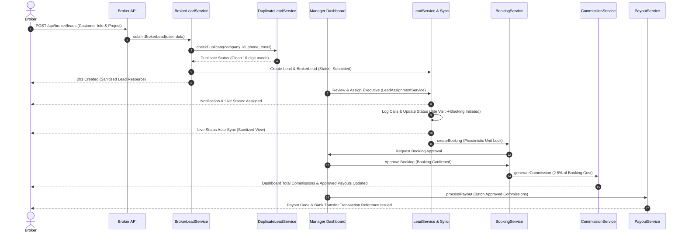

# REOS – End-to-End Broker Lead System Workflow Flow

---

## Complete Lifecycle Overview

```text
               BROKER / CHANNEL PARTNER
                          │
                          ▼
            1. Authenticate & Select Project
                          │
                          ▼
             2. Submit Customer Lead Form
                          │
                          ▼
      3. Intelligent Duplicate Check (`company_id` Scoped)
             ┌────────────┴────────────┐
             ▼                         ▼
      [Duplicate Found]        [Unique Lead]
             │                         │
             └────────────┬────────────┘
                          ▼
            4. Create Lead & BrokerLead Records
                          │
                          ▼
                5. Manager Review Dashboard
                          │
                          ▼
           6. Sales Executive Assignment Logged
             (`lead_assignments` History Table)
                          │
                          ▼
         7. Sales Follow-up & Status Sync Engine
             (CRM Status ➔ Broker Visible Status)
                          │
                          ▼
             8. Site Visit Scheduled & Completed
                          │
                          ▼
          9. Pessimistic Lock Booking Creation
                          │
                          ▼
             10. Manager / Director Approval
                          │
                          ▼
             11. Automatic Commission Generation
                          │
                          ▼
           12. Finance Commission Approval Workflow
                          │
                          ▼
         13. Payout Batching & Bank Transfer Clear
                          │
                          ▼
              BROKER PORTAL REAL-TIME SYNC
```

---

## Detailed Step-by-Step System Operations

### Step 1: Authentication & Identity Resolution
- **Actor**: Broker / Channel Partner.
- **Action**: Logs in via Web Portal (`/login`) or Sanctum API (`POST /api/auth/login`).
- **System Operation**: Resolves authenticated user context and derives tenant `$user->company_id` and `$broker` profile (`user_id === $user->id`).
- **Code Symbol**: [BrokerApiController.php](file:///c:/xampp/htdocs/reos/app/Http/Controllers/Api/BrokerApiController.php#L35)

---

### Step 2: Specific Project Lead Submission
- **Actor**: Broker.
- **Action**: Fills lead form or sends payload to `POST /api/broker/leads`.
- **Payload Data**:
  - Customer Info: `first_name`, `last_name`, `phone`, `alternate_phone`, `email`, `city`, `customer_type`.
  - Requirements: `project_id` (e.g. Apex Grand Residency), `property_type` (3 BHK), `unit_type`, `budget_min` (₹50L), `budget_max` (₹65L), `preferred_location`, `requirement_notes`.
- **System Operation**: Validates project existence within tenant `company_id`.
- **Code Symbol**: [BrokerLeadService.php](file:///c:/xampp/htdocs/reos/app/Services/BrokerLeadService.php#L22)

---

### Step 3: Automated Duplicate Lead Detection Engine
- **Actor**: System Automation.
- **System Operation**: Normalizes phone input to 10 digits (`preg_replace('/[^0-9]/', '', $phone)`) and performs lookup across `phone`, `alternate_phone`, and `email` within `company_id`.
- **Outcome**:
  - If duplicate found: Sets `is_duplicate = true` and `duplicate_of_lead_id = existing_lead.id`. Flags duplicate alert for Manager.
  - Internal duplicate details remain hidden from Broker to protect privacy.
- **Code Symbol**: [DuplicateLeadService.php](file:///c:/xampp/htdocs/reos/app/Services/DuplicateLeadService.php#L12)

---

### Step 4: Lead Creation & Data Isolation
- **Actor**: System Automation.
- **System Operation**:
  1. Inserts main record into `leads` table with generated `lead_code` (e.g. `LD-BRK3752`).
  2. Inserts authoritative partner record into `broker_leads` table (`broker_visible_status = 'Submitted'`).
  3. Writes audit entry to `lead_activities` table.
  4. Dispatches `BrokerLeadSubmitted` event.
- **Code Symbol**: [BrokerLeadService.php](file:///c:/xampp/htdocs/reos/app/Services/BrokerLeadService.php#L55)

---

### Step 5: Manager Review & Executive Assignment
- **Actor**: Sales Manager.
- **Action**: Reviews lead in Manager Dashboard and assigns to a Sales Executive (e.g. Amit).
- **System Operation**:
  1. `LeadAssignmentService::assignLead()` creates an immutable historical record in `lead_assignments` table (recording `assigned_by`, `assigned_to`, `assignment_type`, `previous_assignee_id`, `reason`).
  2. Updates `leads.assigned_to_user_id` and `leads.status = 'assigned'`.
  3. `BrokerLeadStatusService` syncs `broker_visible_status` to `'Assigned'`.
  4. Dispatches `BrokerLeadAssigned` event & sends notifications.
- **Code Symbol**: [LeadAssignmentService.php](file:///c:/xampp/htdocs/reos/app/Services/LeadAssignmentService.php#L18)

---

### Step 6: Sales Follow-up & Status Sync Engine
- **Actor**: Sales Executive.
- **Action**: Logs calls and updates lead pipeline stage (`contacted` → `follow_up` → `site_visit`).
- **System Operation**:
  - `BrokerLeadStatusService::mapInternalToBrokerStatus()` translates CRM statuses into broker visible milestone badges:
    - `new` ➔ **Submitted**
    - `under_review` ➔ **Under Review**
    - `assigned` ➔ **Assigned**
    - `contacted` ➔ **Contacted**
    - `follow_up` ➔ **Follow-up**
    - `site_visit` ➔ **Site Visit Scheduled**
    - `site_visit_completed` ➔ **Site Visit Completed**
    - `interested` ➔ **Interested**
    - `negotiation` ➔ **Negotiation**
    - `booking_initiated` ➔ **Booking Initiated**
    - `converted` / `booked` ➔ **Booked**
    - `lost` ➔ **Lost**
- **Data Privacy**: Strips internal sales remarks, manager notes, and cost prices via `BrokerPrivacyService`.
- **Code Symbol**: [BrokerLeadStatusService.php](file:///c:/xampp/htdocs/reos/app/Services/BrokerLeadStatusService.php#L15)

---

### Step 7: Site Visit Scheduling & Outcome Log
- **Actor**: Field Officer / Sales Executive.
- **Action**: Schedules property tour in `site_visits` table and records outcome (`interested`, `booking_initiated`).
- **System Operation**: Updates `broker_visible_status` to `Site Visit Completed`.
- **Code Symbol**: [SiteVisitApiController.php](file:///c:/xampp/htdocs/reos/app/Http/Controllers/Api/SiteVisitApiController.php)

---

### Step 8: Pessimistic Lock Booking Creation
- **Actor**: Sales Executive.
- **Action**: Selects inventory unit (e.g. Unit 101) and generates Cost Sheet.
- **System Operation**:
  1. `BookingService::createBooking()` executes `Unit::lockForUpdate()` (InnoDB Pessimistic Row Lock) to prevent concurrency double-booking.
  2. Creates `Booking` record (`status = 'pending_approval'`).
  3. Binds `$lead->broker_id` automatically to `$booking->broker_id`.
  4. Updates unit status to `booking_pending`.
  5. Syncs `broker_visible_status` to `Booking Initiated`.
- **Code Symbol**: [BookingService.php](file:///c:/xampp/htdocs/reos/app/Services/BookingService.php#L19)

---

### Step 9: Booking Confirmation & Approval
- **Actor**: Sales Manager / Company Director.
- **Action**: Approves booking request in `BookingController::approve()`.
- **System Operation**:
  1. `Gate::authorize('approve-bookings')` validates authorization.
  2. Updates `booking.approval_status = 'approved'` and `unit.status = 'booked'`.
  3. Dispatches `BrokerBookingConfirmed` event.
  4. Updates `broker_visible_status` to **Booked**.
- **Code Symbol**: [BookingController.php](file:///c:/xampp/htdocs/reos/app/Http/Controllers/BookingController.php#L63)

---

### Step 10: Automatic Broker Commission Generation
- **Actor**: System Automation.
- **System Operation**:
  1. `BrokerCommissionService::generateCommission()` auto-calculates broker commission based on registered broker rate (e.g. 2.5% of ₹60,00,000 = ₹1,50,000).
  2. Creates `broker_commissions` record (`status = 'approved'` / `'ready_for_payout'`).
  3. Dispatches `BrokerCommissionGenerated` event.
  4. Broker Portal displays earned commission under **Total Commissions Earned** & **Approved Payouts**.
- **Code Symbol**: [BrokerCommissionService.php](file:///c:/xampp/htdocs/reos/app/Services/BrokerCommissionService.php#L19)

---

### Step 11: Commission Approval & Payout Batching
- **Actor**: Accounts Admin / Director.
- **Action**: Batches ready-for-payout commissions into a payout clear statement.
- **System Operation**:
  1. `BrokerPayoutService::processPayout()` creates a `BrokerPayout` record (`payout_code`, `amount_paid`, `payment_method`, `transaction_reference`).
  2. Links commissions in `broker_payout_commissions` pivot table.
  3. Updates commission status to `paid`.
  4. Dispatches `BrokerPayoutProcessed` event.
  5. Broker receives payout notification and statement updates to **Paid**.
- **Code Symbol**: [BrokerPayoutService.php](file:///c:/xampp/htdocs/reos/app/Services/BrokerPayoutService.php#L13)

---

## System Workflow Sequence Diagram


