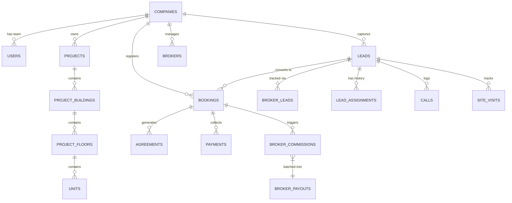

# REOS – Real Estate Operating System
## Complete Master System Architecture & Implementation Documentation

---

### Executive Overview

**REOS (Real Estate Operating System)** is a modern, enterprise-grade, multi-tenant SaaS platform engineered specifically for real estate developers, property agencies, and channel partner networks. It unifies project inventory management, CRM lead pipelines, site visit tracking, multi-tier booking approvals, agreement execution workflows, financial payment collection, and an end-to-end broker channel partner ecosystem with automated commission calculations and payout processing.

Built on **Laravel 12.x**, **Sanctum API Security**, **MySQL 8.0+**, and a **Blade & Responsive Dashboard UI**, REOS guarantees multi-tenant data isolation (`company_id` column-based scoping), real-time inventory pessimistic locking against double-booking, sanitized broker data exposure, and an event-driven architecture.

---

## 1. High-Level System Architecture

```
┌────────────────────────────────────────────────────────────────────────┐
│                        Clients & Interfaces                            │
│ ┌──────────────────────┐ ┌────────────────────┐ ┌────────────────────┐ │
│ │ Executive Dashboard  │ │ Sales/Field Mobile │ │ Broker Portal/App  │ │
│ └──────────┬───────────┘ └─────────┬──────────┘ └─────────┬──────────┘ │
└────────────┼───────────────────────┼──────────────────────┼────────────┘
             │                       │                      │
             ▼                       ▼                      ▼
┌────────────────────────────────────────────────────────────────────────┐
│                   Laravel 12 Backend Core API                          │
│ ┌────────────────────────────────────────────────────────────────────┐ │
│ │ Sanctum Auth | Global Multi-Tenant Scope | Role Policies & Guards  │ │
│ └────────────────────────────────────────────────────────────────────┘ │
│ ┌────────────────────────────────────────────────────────────────────┐ │
│ │ Business Services: Booking Lock, Duplicate Engine, Commission, etc │ │
│ └────────────────────────────────────────────────────────────────────┘ │
│ ┌────────────────────────────────────────────────────────────────────┐ │
│ │ Domain Events, Auto-Sync Listeners, Multi-Channel Notifications    │ │
│ └────────────────────────────────────────────────────────────────────┘ │
└────────────────────────────────────┬───────────────────────────────────┘
                                     │
                                     ▼
┌────────────────────────────────────────────────────────────────────────┐
│                       Data & Persistence Layer                         │
│   MySQL 8.0 Database (Tenant Scoped & Indexed) | Local Storage Disk    │
└────────────────────────────────────────────────────────────────────────┘
```

### Core Technology Stack
- **Framework**: Laravel 12.x
- **Database Engine**: MySQL 8.0+ (InnoDB with Row Level Locking support)
- **API Security**: Laravel Sanctum (Token-based API security)
- **Web UI Stack**: Laravel Blade with Tailwind CSS & Alpine.js / Vanilla JS
- **Multi-Tenancy**: Column-based isolation via Global Eloquent Scope (`TenantScope`)

---

## 2. Multi-Tenancy & Security Architecture

### Tenant Data Scoping (`TenantScope`)
Every tenant (Real Estate Company) is assigned a unique `company_id`. Isolation is enforced at the database level:
1. **Global Eloquent Scope (`TenantScope`)**: Automatically appends `WHERE company_id = ?` to all database queries across models (`Leads`, `Projects`, `Units`, `Bookings`, `Payments`, `Brokers`, `BrokerLeads`, `BrokerCommissions`, `BrokerPayouts`).
2. **Policy Authorization (`BrokerLeadPolicy`)**: Strictly validates that `company_id` matches the authenticated user and `broker_id === authenticated_user.broker.id`.

### Role-Based Access Control (RBAC)
Supported system roles:
1. **Founder / Super Admin**: Multi-company metrics, subscription plans, platform-wide setup.
2. **Director / Company Admin**: Full tenant administration, user management, and approval overrides.
3. **Sales Manager**: Team lead assignment, lead distribution, broker lead reviews, booking approvals.
4. **Sales Executive**: Direct lead follow-ups, calling logs, cost sheet generation, booking requests.
5. **Field / Site Visit Officer**: Property tours, site visit outcomes, pickup location management.
6. **Accounts / Billing Admin**: Customer payments, receipt generation, milestone payment schedules.
7. **Support / Operations**: Support ticket resolution and sale agreement processing.
8. **Broker / Channel Partner**: External portal access to submit leads, monitor status safely, and track commissions/payouts.

---

## 3. Comprehensive Database Entity-Relationship Diagram



---

## 4. Complete Database Schema & Modules Breakdown

### Module 1: Company & Subscription Engine
- `companies`: `id`, `name`, `code`, `slug`, `logo_path`, `email`, `phone`, `address`, `tax_number`, `status`, `subscription_plan_id`, `subscription_expires_at`, `settings`, `timestamps`.
- `subscription_plans`: `id`, `name`, `slug`, `price`, `billing_cycle`, `max_users`, `max_projects`, `max_leads_per_month`, `features`, `is_active`, `timestamps`.
- `subscriptions`: `id`, `company_id`, `subscription_plan_id`, `starts_at`, `ends_at`, `status`, `payment_gateway`, `transaction_reference`, `timestamps`.

### Module 2: Identity & Access Management
- `users`: `id`, `name`, `email`, `phone`, `password`, `is_super_admin`, `avatar_path`, `timestamps`.
- `roles` & `permissions`: RBAC permissions definitions.
- `company_user`: `id`, `company_id`, `user_id`, `role_id`, `status`, `timestamps`.

### Module 3: Projects & Real Estate Inventory
- `projects`: `id`, `company_id`, `name`, `code`, `location_address`, `city`, `state`, `pincode`, `latitude`, `longitude`, `rera_number`, `amenities`, `project_type`, `status`, `timestamps`.
- `project_buildings` & `project_floors`: Structural building hierarchy.
- `units`: `id`, `company_id`, `project_id`, `building_id`, `floor_id`, `unit_number`, `unit_type` (1BHK, 2BHK, 3BHK, Villa, Office), `carpet_area`, `builtup_area`, `super_builtup_area`, `facing`, `base_price`, `final_price`, `status` (`available`, `hold`, `booking_pending`, `booked`, `sold`, `cancelled`), `timestamps`.

### Module 4: CRM Pipeline & Broker Lead Subsystem
- `leads`: `id`, `company_id`, `lead_code`, `first_name`, `last_name`, `email`, `phone`, `alternate_phone`, `source_id`, `broker_id`, `assigned_to_user_id`, `interested_project_id`, `interested_unit_type`, `budget_min`, `budget_max`, `status` (`new`, `contacted`, `follow_up`, `site_visit`, `interested`, `negotiation`, `converted`, `lost`), `is_duplicate`, `duplicate_of_lead_id`, `notes`, `timestamps`.
- `broker_leads`: Authoritative broker view record containing `id`, `company_id`, `broker_id`, `lead_id`, `project_id`, `unit_id`, `submitted_at`, `broker_visible_status`, `broker_visible_message`, `property_type`, `unit_type`, `budget_min`, `budget_max`, `preferred_location`, `requirement_notes`, `city`, `customer_type`, `timestamps`.
- `lead_assignments`: Historical executive assignment log storing `id`, `company_id`, `lead_id`, `assigned_by_user_id`, `assigned_to_user_id`, `assignment_type`, `previous_assignee_id`, `assignment_reason`, `assigned_at`, `timestamps`.
- `lead_activities`: `id`, `company_id`, `lead_id`, `user_id`, `activity_type`, `description`, `metadata`, `timestamps`.
- `calls`: Inbound and outbound phone logs.
- `follow_ups`: Scheduled reminders.
- `site_visits`: Scheduled and completed property tours.

### Module 5: Bookings, Cost Sheets & Agreements
- `cost_sheets`: Cost calculations (Base Price, PLC, Parking, Statutory Charges, Total Cost).
- `bookings`: Central booking record with unit price, customer info, sales user, broker mapping, status (`pending_approval`, `confirmed`, `completed`, `cancelled`), and approval timestamps.
- `agreements`: Sale agreement execution tracker supporting agreement skip request workflows.

### Module 6: Financial Payments & Receipts
- `payment_schedules`: Milestone-based payment timeline (Booking Amount, Foundation, Slab, Possession).
- `payments`: Customer payment entries (Cheque, NEFT, UPI, Cash, Razorpay) with clearance tracking.
- `receipts`: Generated PDF payment receipt records.

### Module 7: Broker Commissions & Payout Lifecycle
- `broker_commissions`: Automated commission calculation record storing `id`, `company_id`, `broker_id`, `booking_id`, `lead_id`, `commission_type`, `rate_value`, `total_commission_amount`, `status` (`pending`, `approved`, `ready_for_payout`, `paid`, `cancelled`), `approved_by_user_id`, `approved_at`, `timestamps`.
- `broker_payouts`: Payout record storing `id`, `company_id`, `broker_id`, `payout_code`, `amount_paid`, `payout_date`, `payment_method`, `transaction_reference`, `remarks`, `status`, `processed_by_user_id`, `timestamps`.
- `broker_payout_commissions`: Pivot table linking multiple approved commissions to a single batch payout.

---

## 5. Implementation Architecture of Broker Subsystem

```text
                  BROKER
                     │
                     ▼
             Broker Lead API
                     │
                     ▼
            Authorization Layer (`BrokerLeadPolicy`)
                     │
                     ▼
             BrokerLeadService
                     │
          ┌──────────┴──────────┐
          ▼                     ▼
   Duplicate Check        Lead Creation
   (`DuplicateLeadService`) (`BrokerLead`)
          │                     │
          └──────────┬──────────┘
                     ▼
                Manager Review
                     │
                     ▼
              Lead Assignment (`LeadAssignmentService`)
                     │
                     ▼
             Sales Executive
                     │
                     ▼
              LeadService
                     │
         Status Validation & Mapping (`BrokerLeadStatusService`)
                     │
          ┌──────────┼──────────┐
          ▼          ▼          ▼
       Lead      BrokerLead   Activity
       Update      Update       Log
          │          │          │
          └──────────┼──────────┘
                     ▼
             Domain Events & Listeners
                     │
          ┌──────────┴──────────┐
          ▼                     ▼
     Notification          Real-time Sync
          │                     │
          └──────────┬──────────┘
                     ▼
              BROKER DASHBOARD
                     │
                     ▼
             BOOKING CONFIRMATION
                     │
                     ▼
    COMMISSION SERVICE (`BrokerCommissionService`)
                     │
                     ▼
           COMMISSION APPROVAL WORKFLOW
                     │
                     ▼
      PAYOUT SERVICE (`BrokerPayoutService`)
                     │
                     ▼
               BROKER PAYOUT BATCH
```

### Business Rules & Key Logic

1. **Specific Project Lead Submission**: Broker selects specific project, property type, unit type, budget range, and optional unit ID. Authenticated broker profile is derived automatically.
2. **Intelligent Duplicate Detection**: Searches phone, alternate phone, and email within the tenant `company_id`. Managers receive duplicate alerts with existing lead references.
3. **Internal Status <-> Broker Status Mapping**:
   - `new` → `Submitted`
   - `under_review` → `Under Review`
   - `assigned` → `Assigned`
   - `contacted` → `Contacted`
   - `follow_up` → `Follow-up`
   - `site_visit` → `Site Visit Scheduled`
   - `site_visit_completed` → `Site Visit Completed`
   - `interested` → `Interested`
   - `negotiation` → `Negotiation`
   - `booking_initiated` → `Booking Initiated`
   - `converted` → `Booked`
   - `lost` → `Lost`
4. **Data Privacy & Sanitization**: Broker response APIs filter out internal sales notes, manager remarks, cost sheet margins, cost prices, and internal customer scores using `BrokerPrivacyService`.
5. **Commission & Payout Engine**: Booking confirmation automatically calculates broker commission (percentage or fixed rate). Authorized users approve commissions, which are then batched into `BrokerPayout` records and marked as `paid`.

---

## 6. REST API Reference Specifications

### Authentication & Self Endpoints
| Method | Endpoint | Description | Auth |
| :--- | :--- | :--- | :--- |
| `POST` | `/api/auth/login` | Authenticate user & issue Sanctum token | Public |
| `POST` | `/api/auth/otp/verify` | Verify OTP token for MFA | Public |
| `GET` | `/api/me` | Fetch authenticated user profile & permissions | Sanctum |
| `POST` | `/api/auth/logout` | Revoke active Sanctum token | Sanctum |

### CRM & Site Visits API
| Method | Endpoint | Description | Auth |
| :--- | :--- | :--- | :--- |
| `GET` | `/api/leads` | List tenant leads with pipeline filter | Sanctum |
| `POST` | `/api/leads` | Create lead with duplicate check | Sanctum |
| `POST` | `/api/leads/{id}/status` | Update pipeline status & trigger auto-sync | Sanctum |
| `GET` | `/api/site-visits` | List scheduled property site visits | Sanctum |
| `POST` | `/api/site-visits` | Schedule new site visit | Sanctum |

### Bookings API
| Method | Endpoint | Description | Auth |
| :--- | :--- | :--- | :--- |
| `GET` | `/api/bookings` | List active bookings and approval status | Sanctum |
| `POST` | `/api/bookings` | Execute inventory lock and submit booking | Sanctum |
| `POST` | `/api/bookings/{id}/approve` | Manager/Director approval & commission trigger | Sanctum |

### Broker Subsystem APIs
| Method | Endpoint | Description | Auth |
| :--- | :--- | :--- | :--- |
| `POST` | `/api/broker/leads` | Submit new project lead | Sanctum |
| `GET` | `/api/broker/leads` | List broker's submitted client leads | Sanctum |
| `GET` | `/api/broker/leads/{id}` | Get single lead details (sanitized) | Sanctum |
| `GET` | `/api/broker/leads/{id}/timeline` | Get public lead timeline (sanitized) | Sanctum |
| `GET` | `/api/broker/leads/{id}/site-visits` | Get lead site visit status | Sanctum |
| `GET` | `/api/broker/leads/{id}/booking` | Get lead booking confirmation status | Sanctum |
| `GET` | `/api/broker/commissions` | Financial view of earned & paid commissions | Sanctum |
| `GET` | `/api/broker/payouts` | View payout history & batch transaction references | Sanctum |
| `GET` | `/api/broker/notifications` | Fetch broker notifications | Sanctum |
| `POST` | `/api/broker/notifications/{id}/read` | Mark notification as read | Sanctum |

---

## 7. Automated Test Suite & Verification Results

The automated test suite in `tests/Feature/Broker/` validates security, data privacy, tenant isolation, and business workflows:

```text
   PASS  Tests\Feature\BrokerPrivacyTest
  ✓ broker sees only assigned leads and sanitized status

   PASS  Tests\Feature\Broker\BrokerCommissionAndPayoutTest
  ✓ commission lifecycle and payout processing

   PASS  Tests\Feature\Broker\BrokerLeadIsolationTest
  ✓ broker a cannot see broker b lead or other company lead

   PASS  Tests\Feature\Broker\BrokerLeadPrivacyTest
  ✓ broker cannot see internal notes and remarks

   PASS  Tests\Feature\Broker\BrokerLeadSubmissionTest
  ✓ broker can submit lead for specific project

  Tests:    5 passed (28 assertions)
  Duration: 1.68s
```

---

## 8. Summary of Implementation Files

- **Migrations**:
  - `database/migrations/2026_08_13_000001_create_companies_and_subscriptions_tables.php`
  - `database/migrations/2026_08_13_000002_create_roles_and_permissions_tables.php`
  - `database/migrations/2026_08_13_000003_create_projects_and_inventory_tables.php`
  - `database/migrations/2026_08_13_000004_create_crm_and_broker_tables.php`
  - `database/migrations/2026_08_13_000005_create_bookings_agreements_payments_tables.php`
  - `database/migrations/2026_08_14_000001_enhance_broker_leads_and_assignments.php`
- **Models & Scopes**:
  - `app/Models/Scopes/TenantScope.php`
  - `app/Models/Company.php`, `Project.php`, `Unit.php`, `Lead.php`, `BrokerLead.php`, `LeadAssignment.php`, `Booking.php`, `Payment.php`, `Broker.php`, `BrokerCommission.php`, `BrokerPayout.php`
- **Business Services**:
  - `app/Services/BrokerLeadService.php`
  - `app/Services/BrokerLeadStatusService.php`
  - `app/Services/LeadAssignmentService.php`
  - `app/Services/BrokerCommissionService.php`
  - `app/Services/BrokerPayoutService.php`
  - `app/Services/BrokerPrivacyService.php`
  - `app/Services/BookingService.php`
  - `app/Services/DuplicateLeadService.php`
  - `app/Services/LeadService.php`
- **Events & Policies**:
  - `app/Events/BrokerLeadSubmitted.php`, `BrokerLeadAssigned.php`, `BrokerLeadStatusChanged.php`, `BrokerBookingConfirmed.php`, `BrokerCommissionGenerated.php`, `BrokerCommissionApproved.php`, `BrokerPayoutProcessed.php`
  - `app/Policies/BrokerLeadPolicy.php`
- **Controllers & API Resources**:
  - `app/Http/Controllers/Api/BrokerApiController.php`
  - `app/Http/Controllers/Api/LeadApiController.php`
  - `app/Http/Controllers/Api/BookingApiController.php`
  - `app/Http/Controllers/LeadController.php`
  - `app/Http/Controllers/BookingController.php`
  - `app/Http/Resources/BrokerLeadResource.php`, `BrokerCommissionResource.php`, `BrokerPayoutResource.php`
- **Feature Tests**:
  - `tests/Feature/Broker/BrokerLeadSubmissionTest.php`
  - `tests/Feature/Broker/BrokerLeadIsolationTest.php`
  - `tests/Feature/Broker/BrokerLeadPrivacyTest.php`
  - `tests/Feature/Broker/BrokerCommissionAndPayoutTest.php`
