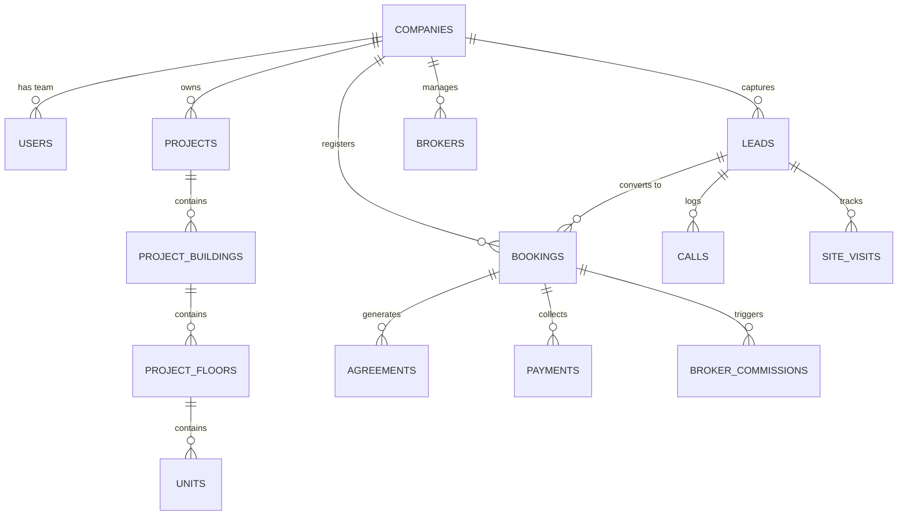

# REOS – Real Estate Operating System
## Complete System Technical & Operational Documentation

---

### Executive Summary

**REOS (Real Estate Operating System)** is an enterprise-grade, multi-tenant SaaS platform engineered specifically for real estate developers, property agencies, and brokerage networks. It unifies project inventory management, CRM lead pipelines, site visit tracking, multi-tier booking approvals, agreement execution workflows, payment collection, and broker commission payouts into a single secure platform.

Built on **Laravel 12.x** with **Sanctum API Authentication**, **MySQL 8.0+**, and a **Modern Dashboard Interface**, REOS ensures multi-tenant isolation, real-time inventory locking against double-booking, and sanitized broker data exposure.

---

## 1. System Architecture & Tech Stack

```
┌────────────────────────────────────────────────────────────────────────┐
│                        Clients & Interfaces                            │
│ ┌──────────────────────┐ ┌────────────────────┐ ┌────────────────────┐ │
│ │ Executive Dashboard  │ │ Sales/Field Mobile │ │ Broker Portal/App  │ │
│ └──────────┬───────────┘ └─────────┬──────────┘ └─────────┬──────────┘ │
└────────────┼───────────────────────┼──────────────────────┼────────────┘
             │                       │                      │
             ▼                       ▼                      ▼
┌────────────────────────────────────────────────────────────────────────┐
│                   Laravel 12 Backend Core                              │
│ ┌────────────────────────────────────────────────────────────────────┐ │
│ │ Sanctum Auth | Global Multi-Tenant Scope | Role Policies & Guards  │ │
│ └────────────────────────────────────────────────────────────────────┘ │
│ ┌────────────────────────────────────────────────────────────────────┐ │
│ │ Business Services: Booking Lock, Duplicate Check, Commission, etc  │ │
│ └────────────────────────────────────────────────────────────────────┘ │
└────────────────────────────────────┬───────────────────────────────────┘
                                     │
                                     ▼
┌────────────────────────────────────────────────────────────────────────┐
│                       Data & Persistence Layer                         │
│       MySQL 8.0 Database (`company_id` Scoped) | Storage Disk         │
└────────────────────────────────────────────────────────────────────────┘
```

### Technical Stack Specifications
- **Framework**: Laravel 12.x
- **Database**: MySQL 8.0+ (InnoDB with Pessimistic Row Locking support)
- **API Authentication**: Laravel Sanctum (Token-based API security)
- **Web UI Stack**: Laravel Blade with Tailwind CSS & Vanilla JS
- **Multi-Tenancy**: Single Database, Column-based Isolation (`company_id`) via Global Eloquent Scopes (`TenantScope`)

---

## 2. Multi-Tenancy & Security Architecture

### Single-Database Multi-Tenant Isolation
Every tenant (Real Estate Company) is assigned a unique `company_id`. Data access is guarded automatically at two levels:
1. **Global Eloquent Scope (`TenantScope`)**: Automatically appends `WHERE company_id = ?` to all database queries across models (Leads, Projects, Units, Bookings, Payments, Brokers, etc.).
2. **Controller/Policy Checks**: Verifies user company matching prior to processing mutations.

### Role-Based Access Control (RBAC)
REOS supports 8 pre-configured roles:
1. **Founder / Super Admin**: Platform level administration & cross-tenant metrics.
2. **Director / Company Admin**: Full control over company settings, user management, and approval overrides.
3. **Sales Manager**: Team lead assignment, lead distribution, booking approval request handling.
4. **Sales Executive**: Direct lead ownership, calling logs, cost sheet generation, booking creation.
5. **Field / Site Visit Officer**: Site visit scheduling, location pickup, customer feedback logs.
6. **Accounts / Billing Admin**: Payment recording, receipt issuance, milestone schedule management.
7. **Support / Operations**: Support ticket handling and agreement document processing.
8. **Broker / Channel Partner**: External portal access to submit leads, monitor status safely, and track commissions.

---

## 3. Database Entity Relationship & Modules



### Module Breakdown

#### Module 1: Company & Subscription Management
- `companies`: Stores company profile, slug, logo, tax numbers, and subscription status.
- `subscription_plans`: Manages SaaS pricing tiers (Bronze, Silver, Gold, Enterprise).
- `subscriptions`: Active subscription records with start/expiration dates.
- `discount_requests`: Custom discount approval workflow for SaaS subscriptions.

#### Module 2: Access & Identity Management
- `users`: Core user accounts.
- `roles` & `permissions`: Standard RBAC permissions mapping.
- `company_user`: Pivot mapping users to companies with specific roles.

#### Module 3: Projects & Real Estate Inventory
- `projects`: Master project records with RERA numbers, geolocation, and amenities.
- `project_buildings` & `project_floors`: Structural hierarchy.
- `units`: Individual apartments, villas, plots, or office spaces.
  - **Statuses**: `available`, `hold`, `booking_pending`, `booked`, `agreement_pending`, `sold`, `cancelled`.

#### Module 4: CRM Pipeline & Lead Engine
- `lead_sources`: Channels (Facebook, Direct Walk-in, Broker, Web Portal, MagicBricks, Housing.com).
- `leads`: Core prospective buyer records with budget range, interested project, and status.
  - **Statuses**: `new`, `contacted`, `follow_up`, `site_visit`, `interested`, `negotiation`, `converted`, `lost`.
- `lead_activities`: Comprehensive audit trail of status changes, note updates, and assignments.
- `calls`: Inbound and outbound phone log entries with outcomes.
- `follow_ups`: Scheduled call/meeting reminders.
- `site_visits`: Scheduled and completed property tours.

#### Module 5: Bookings, Cost Sheets & Agreements
- `cost_sheets`: Detailed unit cost calculations (Base Price, PLC, Parking, GST, Stamp Duty).
- `bookings`: Central booking record with unit price, customer info, sales user, and broker mapping.
- `agreements`: Sale agreement execution tracker, supporting agreement skip requests.

#### Module 6: Payments & Financial Collection
- `payment_schedules`: Milestone-based payment timeline (Booking Amount, Foundation, Slab 1, Possession).
- `payments`: Customer payment entries (Cheque, NEFT, UPI, Cash) with clearance tracking.

#### Module 7: Broker Channel Partner Engine
- `brokers`: Registered channel partner agencies with payout bank details and commission rates.
- `broker_leads`: Mapping between brokers and submitted client leads.
- `broker_commissions`: Automated commission calculation records linked to approved bookings.

---

## 4. Core Business Logic & Services

### 1. Concurrency-Safe Inventory Locking (`BookingService`)
To eliminate double-booking when multiple sales agents attempt to book the same unit simultaneously:
```php
public function createBooking(array $data, User $user): Booking
{
    return DB::transaction(function () use ($data, $user) {
        $unit = Unit::where('id', $data['unit_id'])
            ->where('company_id', $user->company_id)
            ->lockForUpdate() // Database Pessimistic Lock
            ->firstOrFail();

        if (!in_array($unit->status, ['available', 'hold'])) {
            throw new Exception("Unit {$unit->unit_number} is no longer available for booking.");
        }

        $booking = Booking::create([
            'company_id' => $user->company_id,
            'booking_code' => 'BK-' . strtoupper(Str::random(8)),
            'lead_id' => $data['lead_id'],
            'project_id' => $unit->project_id,
            'unit_id' => $unit->id,
            'sales_user_id' => $user->id,
            'broker_id' => $data['broker_id'] ?? null,
            'booking_amount' => $data['booking_amount'],
            'total_unit_cost' => $data['total_unit_cost'],
            'status' => 'pending_approval',
            'approval_status' => 'pending',
        ]);

        $unit->update(['status' => 'booking_pending']);
        return $booking;
    });
}
```

### 2. Intelligent Duplicate Lead Detection (`DuplicateLeadService`)
Before inserting new leads via API or manual submission, the engine checks existing records by phone number or email within the same tenant company:
```php
public function checkDuplicate(int $companyId, string $phone, ?string $email): ?Lead
{
    return Lead::where('company_id', $companyId)
        ->where(function ($query) use ($phone, $email) {
            $query->where('phone', $phone)
                  ->orWhere('alternate_phone', $phone);
            if ($email) {
                $query->orWhere('email', $email);
            }
        })->first();
}
```

### 3. Automated Broker Commission Engine (`CommissionService`)
When a booking receives formal manager/director approval, the system automatically calculates broker commissions according to registered broker rates:
```php
public function generateCommission(Booking $booking): ?BrokerCommission
{
    if (!$booking->broker_id) return null;

    $broker = Broker::find($booking->broker_id);
    $rate = $broker->commission_rate ?? 2.0; // Default 2.0%
    $commissionAmount = ($booking->total_unit_cost * $rate) / 100;

    return BrokerCommission::create([
        'company_id' => $booking->company_id,
        'broker_id' => $broker->id,
        'booking_id' => $booking->id,
        'lead_id' => $booking->lead_id,
        'commission_type' => 'percentage',
        'rate_value' => $rate,
        'total_commission_amount' => $commissionAmount,
        'status' => 'pending'
    ]);
}
```

### 4. Broker Data Privacy & Sanitization Engine (`BrokerApiController`)
External channel partners are restricted from viewing internal developer metadata (such as internal sales notes, customer budget caps, or internal margin discounts). Status updates are sanitized into client-friendly progress indicators (`Received`, `In Touch`, `Site Visit Done`, `Booked`).

---

## 5. API Reference Specifications

### Authentication API Endpoints
| Method | Endpoint | Description | Auth Required |
| :--- | :--- | :--- | :--- |
| `POST` | `/api/auth/login` | Authenticate user & issue Sanctum token | No |
| `POST` | `/api/auth/otp/verify` | Verify OTP token for MFA | No |
| `GET` | `/api/me` | Fetch authenticated user profile & permissions | Yes (Sanctum) |
| `POST` | `/api/auth/logout` | Revoke current API token | Yes (Sanctum) |

### CRM & Lead Pipeline API
| Method | Endpoint | Description | Auth Required |
| :--- | :--- | :--- | :--- |
| `GET` | `/api/leads` | List tenant leads (Filterable by status, sales user) | Yes |
| `POST` | `/api/leads` | Create new lead with duplicate check | Yes |
| `POST` | `/api/leads/{id}/status` | Update lead pipeline stage & activity log | Yes |

### Site Visits API
| Method | Endpoint | Description | Auth Required |
| :--- | :--- | :--- | :--- |
| `GET` | `/api/site-visits` | List scheduled and past site visits | Yes |
| `POST` | `/api/site-visits` | Schedule new site visit with location pickup details | Yes |

### Bookings API
| Method | Endpoint | Description | Auth Required |
| :--- | :--- | :--- | :--- |
| `GET` | `/api/bookings` | List active bookings and approval status | Yes |
| `POST` | `/api/bookings` | Execute lock and submit unit booking | Yes |
| `POST` | `/api/bookings/{id}/approve` | Manager/Director approval to confirm booking | Yes |

### Broker Portal API
| Method | Endpoint | Description | Auth Required |
| :--- | :--- | :--- | :--- |
| `GET` | `/api/broker/leads` | View broker's submitted client leads & safe status | Yes |
| `POST` | `/api/broker/leads` | Submit new prospective client lead | Yes |
| `GET` | `/api/broker/commissions` | View earned & paid broker commissions | Yes |

---

## 6. Web Dashboard UI Features

1. **Executive Multi-Role Dashboard**: Visual KPIs displaying total active leads, converted bookings, revenue pipeline, inventory availability matrix, and site visit schedules.
2. **Interactive Unit Matrix Grid**: Color-coded real-time inventory matrix (`Green` = Available, `Amber` = Hold/Pending, `Red` = Booked/Sold).
3. **CRM Lead Pipeline Board**: Full lead status lifecycle tracking with single-click status updates and activity timeline.
4. **Booking & Approval Workflows**: Two-tier approval process (Manager & Director) with agreement skip request capabilities.
5. **Sample Data Seeder**: Built-in interactive demo sample data generator (`POST /dashboard/seed-sample`) allowing instant system demo and verification.

---

## 7. Verification & Operational Instructions

### Installation & Local Setup
1. **Clone & Configure**:
   Ensure MySQL database `reos` is created in XAMPP/MySQL.
2. **Environment Setup**:
   ```env
   DB_CONNECTION=mysql
   DB_HOST=127.0.0.1
   DB_PORT=3306
   DB_DATABASE=reos
   DB_USERNAME=root
   DB_PASSWORD=
   ```
3. **Execute Database Migrations**:
   ```bash
   php artisan migrate
   ```
4. **Seed Initial Demo Accounts & Data**:
   ```bash
   php artisan db:seed
   ```
   *Alternatively, log into the dashboard and click "Generate Sample Demo Data".*

5. **Start Application Server**:
   ```bash
   php artisan serve
   ```
   Access the dashboard at `http://127.0.0.1:8000`.

---

## 8. Summary of Created Implementation Files

- **Database Migrations**:
  - `database/migrations/2026_08_13_000001_create_companies_and_subscriptions_tables.php`
  - `database/migrations/2026_08_13_000002_create_roles_and_permissions_tables.php`
  - `database/migrations/2026_08_13_000003_create_projects_and_inventory_tables.php`
  - `database/migrations/2026_08_13_000004_create_crm_and_broker_tables.php`
  - `database/migrations/2026_08_13_000005_create_bookings_agreements_payments_tables.php`
- **Core Models & Scopes**:
  - `app/Models/Scopes/TenantScope.php`
  - `app/Models/Company.php`, `Project.php`, `Unit.php`, `Lead.php`, `Booking.php`, `Payment.php`, `Broker.php`, `BrokerCommission.php`, `Agreement.php`, `SiteVisit.php`
- **Business Services**:
  - `app/Services/BookingService.php`
  - `app/Services/LeadService.php`
  - `app/Services/DuplicateLeadService.php`
  - `app/Services/CommissionService.php`
  - `app/Services/PaymentService.php`
  - `app/Services/SiteVisitService.php`
  - `app/Services/NotificationService.php`
  - `app/Services/StorageService.php`
- **Controllers & API Controllers**:
  - `app/Http/Controllers/DashboardController.php`
  - `app/Http/Controllers/LeadController.php`
  - `app/Http/Controllers/ProjectController.php`
  - `app/Http/Controllers/BookingController.php`
  - `app/Http/Controllers/BrokerController.php`
  - `app/Http/Controllers/Api/AuthController.php`
  - `app/Http/Controllers/Api/LeadApiController.php`
  - `app/Http/Controllers/Api/BookingApiController.php`
  - `app/Http/Controllers/Api/BrokerApiController.php`
  - `app/Http/Controllers/Api/SiteVisitApiController.php`
- **Views**:
  - `resources/views/dashboard/index.blade.php`
  - `resources/views/leads/index.blade.php`
  - `resources/views/projects/index.blade.php`
  - `resources/views/bookings/index.blade.php`
