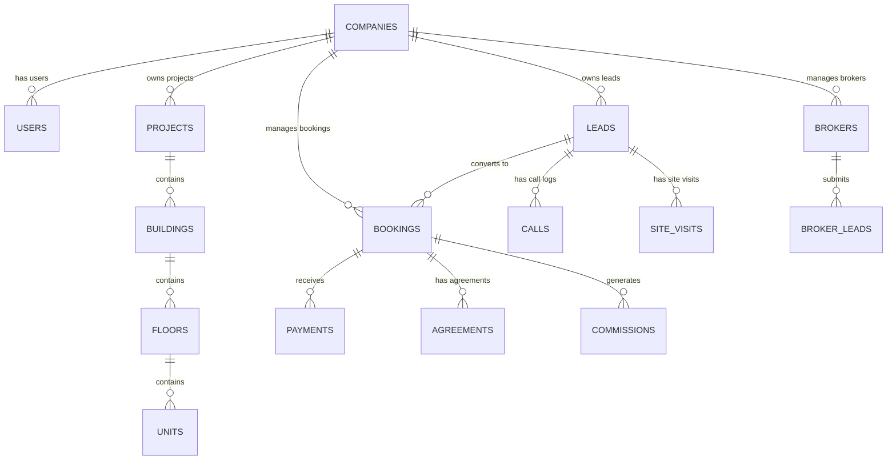

# REOS – Real Estate Operating System Implementation Plan

REOS is a multi-tenant SaaS-based Real Estate Operating System for managing real-estate companies, projects, properties, inventory, CRM leads, sales teams, site visits, bookings, cost sheets, agreements, payments, brokers/channel partners, commissions, notifications, subscriptions, and support tickets.

This plan details the technical architecture, complete database schema design, multi-tenant isolation strategy, core business services, API architecture, role-based security, and phased execution roadmap for building REOS using Laravel 12.x REST APIs and a modern Web Dashboard interface.

---

## User Review Required

> [!IMPORTANT]
> **Multi-Tenancy Strategy Decision**:
> We propose using a **Single-Database, Column-Based (`company_id` Tenant Scoped)** multi-tenancy approach with global Laravel Eloquent scopes and strict Policy checks. This balances high performance, simple deployment, and scalability across hundreds of tenant companies while maintaining strict data isolation.
>
> *Alternative*: Database-per-tenant (requires dynamic DB migrations/connections per company). Please indicate if dynamic multi-database architecture is preferred instead.

> [!IMPORTANT]
> **Frontend Stack & Authentication**:
> We will use **Laravel Breeze (Blade Stack)** for clean, secure authentication (Login, Register, Password Reset) paired with rich **Laravel Blade views & Vanilla/Tailwind CSS** for all multi-role dashboards (Founder, Director, Admin, Manager, Sales, Field, Support, Broker).
>
> **Image & Document Storage**:
> File uploads (company logos, project banners, floor plans, site visit attachments, agreement PDFs) will be handled via a unified `StorageService` configured for local `public/uploads` directory access with optional Firebase Cloud Storage integration.

---

## Open Questions

> [!NOTE]
> 1. **Payment Gateway Provider**: **Razorpay (India)** is configured as the default payment gateway integration for booking payments, customer receipts, and company subscription renewals (with optional webhook listeners for payment verification).
> 2. **Default Currency & Tax Configuration**: INR (₹) with Indian GST structure (CGST/SGST/IGST breakdown) for cost sheets and receipts.

---

## Proposed Technical Architecture & Design

### Architectural Layers
```
┌────────────────────────────────────────────────────────────────────────┐
│                        Clients / Consumers                             │
│ ┌──────────────────────┐ ┌────────────────────┐ ┌────────────────────┐ │
│ │  Web Dashboard (SPA) │ │ Sales/Field Mobile │ │ Broker Portal/App  │ │
│ └──────────┬───────────┘ └─────────┬──────────┘ └─────────┬──────────┘ │
└────────────┼───────────────────────┼──────────────────────┼────────────┘
             │                       │                      │
             ▼                       ▼                      ▼
┌────────────────────────────────────────────────────────────────────────┐
│                   Laravel 12 REST API Backend                          │
│ ┌────────────────────────────────────────────────────────────────────┐ │
│ │ Sanctum Auth | Multi-Tenant Global Scopes | Policy & Gate Guard    │ │
│ └────────────────────────────────────────────────────────────────────┘ │
│ ┌────────────────────────────────────────────────────────────────────┐ │
│ │ Business Services: Lead, Booking (Pessimistic Lock), Commission, etc│ │
│ └────────────────────────────────────────────────────────────────────┘ │
│ ┌────────────────────────────────────────────────────────────────────┐ │
│ │ Jobs, Queues (Redis/Database), Notifications, Event Dispatchers     │ │
│ └────────────────────────────────────────────────────────────────────┘ │
└────────────────────────────────────┬───────────────────────────────────┘
                                     │
                                     ▼
┌────────────────────────────────────────────────────────────────────────┐
│                       Data & Storage Layer                             │
│   MySQL 8.0+ Database (Indexed company_id) | Local / S3 Cloud Storage  │
└────────────────────────────────────────────────────────────────────────┘
```

---

## Proposed Database Schema & Models

Below is the complete database structure designed with all 30+ relational modules and explicit `company_id` multi-tenant keys where applicable.



### Table Definitions & Key Relationships

1. **`companies`**: `id`, `name`, `code`, `slug`, `logo_path`, `email`, `phone`, `address`, `tax_number`, `status` (active, suspended), `subscription_plan_id`, `subscription_expires_at`, `settings` (JSON), `timestamps`.
2. **`subscription_plans`**: `id`, `name`, `slug`, `price`, `billing_cycle` (monthly, yearly), `max_users`, `max_projects`, `max_leads_per_month`, `features` (JSON), `is_active`, `timestamps`.
3. **`subscriptions`**: `id`, `company_id`, `subscription_plan_id`, `starts_at`, `ends_at`, `status`, `payment_gateway`, `transaction_reference`, `timestamps`.
4. **`discount_requests`**: `id`, `company_id`, `requested_by_user_id`, `plan_id`, `discount_percent`, `reason`, `status` (pending, approved, rejected), `approved_by_user_id`, `timestamps`.
5. **`users`**: `id`, `name`, `email`, `phone`, `password`, `is_super_admin` (boolean), `avatar_path`, `remember_token`, `timestamps`.
6. **`company_user`**: `id`, `company_id`, `user_id`, `role_id`, `status` (active, inactive), `invited_at`, `timestamps`.
7. **`roles`**: `id`, `company_id` (null for system roles like SuperAdmin), `name`, `slug`, `description`, `timestamps`.
8. **`permissions`**: `id`, `name`, `slug`, `module`, `description`, `timestamps`.
9. **`role_permissions`**: `role_id`, `permission_id`.
10. **`projects`**: `id`, `company_id`, `name`, `code`, `location_address`, `city`, `state`, `pincode`, `latitude`, `longitude`, `rera_number`, `amenities` (JSON), `project_type` (residential, commercial, mixed, land), `status` (planning, active, completed), `banner_image`, `documents` (JSON), `timestamps`.
11. **`project_buildings`**: `id`, `project_id`, `company_id`, `name`, `code`, `total_floors`, `total_units`, `timestamps`.
12. **`project_floors`**: `id`, `building_id`, `company_id`, `floor_number`, `name`, `total_units`, `timestamps`.
13. **`units`**: `id`, `company_id`, `project_id`, `building_id`, `floor_id`, `unit_number`, `unit_type` (1BHK, 2BHK, 3BHK, Villa, Plot, Office), `carpet_area`, `builtup_area`, `super_builtup_area`, `facing`, `base_price`, `final_price`, `status` (available, hold, booking_pending, booked, agreement_pending, sold, cancelled), `holding_expires_at`, `hold_by_user_id`, `timestamps`.
14. **`lead_sources`**: `id`, `company_id`, `name`, `slug`, `is_active`, `timestamps`.
15. **`brokers`**: `id`, `company_id`, `user_id`, `agency_name`, `broker_code`, `phone`, `email`, `commission_rate`, `status` (pending, active, suspended), `payout_bank_details` (JSON), `timestamps`.
16. **`leads`**: `id`, `company_id`, `lead_code`, `first_name`, `last_name`, `email`, `phone`, `alternate_phone`, `source_id`, `broker_id` (nullable), `assigned_to_user_id` (nullable), `interested_project_id` (nullable), `interested_unit_type` (nullable), `budget_min`, `budget_max`, `status` (new, contacted, follow_up, site_visit, interested, negotiation, converted, lost), `lost_reason`, `is_duplicate` (boolean), `duplicate_of_lead_id` (nullable), `notes`, `timestamps`.
17. **`broker_leads`**: `id`, `company_id`, `broker_id`, `lead_id`, `project_id`, `submitted_at`, `broker_visible_status`, `timestamps`.
18. **`lead_assignments`**: `id`, `company_id`, `lead_id`, `assigned_by_user_id`, `assigned_to_user_id`, `assigned_at`, `remarks`, `timestamps`.
19. **`lead_activities`**: `id`, `company_id`, `lead_id`, `user_id`, `activity_type` (status_change, note_added, assigned, site_visit_scheduled, call_logged), `description`, `metadata` (JSON), `timestamps`.
20. **`calls`**: `id`, `company_id`, `lead_id`, `user_id`, `call_type` (outbound, inbound), `call_outcome` (connected, not_connected, busy, callback_required, missed), `notes`, `call_duration_seconds`, `called_at`, `next_followup_at`, `timestamps`.
21. **`follow_ups`**: `id`, `company_id`, `lead_id`, `user_id`, `scheduled_at`, `reminder_at`, `status` (pending, completed, missed, cancelled), `notes`, `completed_at`, `timestamps`.
22. **`site_visits`**: `id`, `company_id`, `lead_id`, `project_id`, `unit_id` (nullable), `assigned_to_user_id`, `scheduled_at`, `visited_at`, `status` (scheduled, completed, cancelled, no_show), `outcome` (interested, follow_up_required, not_interested, booking_initiated), `feedback_notes`, `pickup_location`, `timestamps`.
23. **`cost_sheets`**: `id`, `company_id`, `project_id`, `unit_id`, `base_cost`, `plc_cost` (preferential location charge), `parking_cost`, `statutory_charges` (GST, Stamp duty, registration), `other_charges`, `total_cost`, `payment_plan_type` (construction_linked, time_linked, lump_sum), `valid_until`, `created_by_user_id`, `timestamps`.
24. **`bookings`**: `id`, `company_id`, `booking_code`, `lead_id`, `customer_name`, `customer_email`, `customer_phone`, `project_id`, `unit_id`, `sales_user_id`, `broker_id` (nullable), `cost_sheet_id`, `booking_amount`, `total_unit_cost`, `booking_date`, `status` (pending_approval, confirmed, agreement_pending, completed, cancelled), `approval_status` (pending, approved, rejected), `approved_by_user_id`, `approved_at`, `rejection_reason`, `cancellation_reason`, `timestamps`.
25. **`booking_approvals`**: `id`, `company_id`, `booking_id`, `approver_user_id`, `level` (manager, director), `status` (pending, approved, rejected), `remarks`, `actioned_at`, `timestamps`.
26. **`agreements`**: `id`, `company_id`, `booking_id`, `agreement_number`, `draft_file_path`, `signed_file_path`, `status` (pending_draft, pending_signature, completed, skip_requested, skipped), `skip_requested_by_user_id`, `skip_approved_by_user_id`, `skip_reason`, `executed_at`, `timestamps`.
27. **`agreement_approvals`**: `id`, `company_id`, `agreement_id`, `user_id`, `type` (skip_approval, content_approval), `status` (pending, approved, rejected), `remarks`, `timestamps`.
28. **`payment_schedules`**: `id`, `company_id`, `booking_id`, `milestone_name`, `due_date`, `due_amount`, `paid_amount`, `status` (pending, partially_paid, paid, overdue), `timestamps`.
29. **`payments`**: `id`, `company_id`, `booking_id`, `payment_schedule_id` (nullable), `receipt_number`, `amount`, `payment_date`, `payment_method` (cheque, net_banking, upi, card, cash), `transaction_reference`, `bank_name`, `status` (pending_clearance, cleared, bounced, rejected), `recorded_by_user_id`, `cleared_at`, `notes`, `timestamps`.
30. **`receipts`**: `id`, `company_id`, `payment_id`, `receipt_code`, `pdf_path`, `generated_at`, `timestamps`.
31. **`broker_commissions`**: `id`, `company_id`, `broker_id`, `booking_id`, `lead_id`, `commission_type` (percentage, fixed), `rate_value`, `total_commission_amount`, `status` (pending, approved, ready_for_payout, paid, cancelled), `approved_by_user_id`, `approved_at`, `timestamps`.
32. **`broker_payouts`**: `id`, `company_id`, `broker_id`, `payout_code`, `amount_paid`, `payout_date`, `payment_method`, `transaction_reference`, `remarks`, `status` (processing, completed, failed), `processed_by_user_id`, `timestamps`.
33. **`notifications`**: Laravel standard notifications table (`id`, `type`, `notifiable_type`, `notifiable_id`, `data` (JSON with title, message, url, action), `read_at`, `timestamps`).
34. **`support_tickets`**: `id`, `company_id`, `user_id`, `ticket_code`, `subject`, `category` (technical, billing, lead_issue, general), `priority` (low, medium, high, urgent), `status` (open, in_progress, resolved, closed), `assigned_to_user_id`, `timestamps`.
35. **`ticket_replies`**: `id`, `ticket_id`, `user_id`, `message`, `attachments` (JSON), `timestamps`.
36. **`activity_logs`**: `id`, `company_id`, `user_id`, `module`, `action`, `subject_type`, `subject_id`, `properties` (JSON with old/new values), `ip_address`, `user_agent`, `timestamps`.

---

## Key Technical Workflows & Logic Implementation

### 1. Concurrency-Safe Booking & Inventory Locking (`BookingService`)
```php
public function createBooking(array $data, User $user): Booking
{
    return DB::transaction(function () use ($data, $user) {
        // 1. Lock Unit row for update to prevent double-booking race condition
        $unit = Unit::where('id', $data['unit_id'])
            ->where('company_id', $user->company_id)
            ->lockForUpdate()
            ->firstOrFail();

        if (!in_array($unit->status, ['available', 'hold'])) {
            throw new UnitNotAvailableException("Unit {$unit->unit_number} is no longer available.");
        }

        // 2. Create Booking record
        $booking = Booking::create([
            'company_id' => $user->company_id,
            'booking_code' => $this->generateBookingCode($user->company_id),
            'lead_id' => $data['lead_id'],
            'project_id' => $unit->project_id,
            'unit_id' => $unit->id,
            'sales_user_id' => $user->id,
            'broker_id' => $data['broker_id'] ?? null,
            'cost_sheet_id' => $data['cost_sheet_id'],
            'booking_amount' => $data['booking_amount'],
            'total_unit_cost' => $data['total_unit_cost'],
            'status' => 'pending_approval',
            'approval_status' => 'pending',
        ]);

        // 3. Atomically update unit status
        $unit->update(['status' => 'booking_pending']);

        // 4. Create Activity & Audit Log
        LeadActivity::create([...]);

        // 5. Dispatch Event for Notifications & Broker Status Sync
        event(new BookingCreated($booking));

        return $booking;
    });
}
```

### 2. Duplicate Lead Detection Engine (`DuplicateLeadService`)
When creating or importing a lead, check phone, email, and alternate numbers within the current `company_id`:
```php
public function checkDuplicate(string $companyId, string $phone, ?string $email): ?Lead
{
    return Lead::where('company_id', $companyId)
        ->where(function ($q) use ($phone, $email) {
            $q->where('phone', $phone)
              ->orWhere('alternate_phone', $phone);
            if ($email) {
                $q->orWhere('email', $email);
            }
        })
        ->first();
}
```

### 3. Broker Lead Isolation & Sanitized Auto-Status Sync (`BrokerLeadPolicy` + Listener)
Broker responses strictly sanitize internal fields (`internal_notes`, `manager_remarks`, `sales_budget`, etc.) and show only client-safe progress milestones (`Contacted`, `Site Visit Scheduled`, `Negotiation`, `Booked`, `Lost`).

---

## Proposed Changes & Code Structure

We will initialize a clean, modern Laravel 12 application in the root repository `c:\xampp\htdocs\reos`.

### [Component 1] Core Framework & Database Setup
- Initializes composer project with Laravel 12, Sanctum, and Pest/PHPUnit.
- Configures environment `.env`, MySQL database, and storage disk.

#### [NEW] [Composer / Config files](file:///c:/xampp/htdocs/reos/composer.json)
#### [NEW] [Database Migrations](file:///c:/xampp/htdocs/reos/database/migrations/)
- Migrations for all 36 tables defined in schema.

#### [NEW] [Models & Scopes](file:///c:/xampp/htdocs/reos/app/Models/)
- `Company`, `User`, `Project`, `Building`, `Floor`, `Unit`, `Lead`, `Call`, `FollowUp`, `SiteVisit`, `Booking`, `Agreement`, `Payment`, `Broker`, `BrokerCommission`, `Subscription`, `SupportTicket`, `ActivityLog`.
- `TenantScope`: Global Eloquent scope applying `company_id` filter automatically for non-superadmins.

### [Component 2] Business Logic Services
#### [NEW] [Services](file:///c:/xampp/htdocs/reos/app/Services/)
- `LeadService.php`: Manages lead pipeline transitions and activity logging.
- `DuplicateLeadService.php`: Phone/email lookup and merge request handling.
- `BookingService.php`: Transactional unit lock and cost sheet validations.
- `CommissionService.php`: Calculates fixed/percentage broker payouts on booking approval.
- `PaymentService.php`: Records payments, updates schedules, and triggers receipt PDF jobs.
- `NotificationService.php`: Multi-channel (In-app, Email, WhatsApp stub) notifications.

### [Component 3] REST API Controllers & Resources
#### [NEW] [API Controllers](file:///c:/xampp/htdocs/reos/app/Http/Controllers/Api/)
- `AuthController.php`
- `CompanyController.php`
- `UserController.php`
- `ProjectController.php`
- `UnitController.php`
- `LeadController.php`
- `CallController.php`
- `SiteVisitController.php`
- `BookingController.php`
- `AgreementController.php`
- `PaymentController.php`
- `BrokerController.php`
- `ReportController.php`
- `SubscriptionController.php`
- `TicketController.php`

### [Component 4] Web Dashboard UI / Prototype
#### [NEW] [Web Dashboard Layout & Assets](file:///c:/xampp/htdocs/reos/resources/views/ & public/)
- Rich, modern, interactive web dashboard showcasing multi-role capabilities (Founder, Admin, Manager, Sales, Broker views), analytics charts, inventory interactive matrix (Available/Hold/Booked grid), lead Kanban pipeline, booking request manager, cost sheet generator, and payment receipt builder.

---

## Verification Plan

### Automated Verification
- Run database migrations: `php artisan migrate:fresh --seed`
- Execute automated PHPUnit / Pest tests:
  - Multi-tenant data isolation tests (`TenantIsolationTest.php`)
  - Unit double-booking concurrency test (`BookingConcurrencyTest.php`)
  - Broker sanitized lead status API test (`BrokerPrivacyTest.php`)
  - Duplicate lead matching test (`DuplicateLeadTest.php`)

### Manual Verification & UI Validation
- Verify login authentication for all 8 roles (Founder, Director, Admin, Manager, Sales Executive, Field Team, Support, Broker).
- Test interactive unit matrix visually to confirm real-time status changes (Available -> Hold -> Pending Booking -> Booked).
- Test Lead Pipeline drag-and-drop status update and auto-generated audit activity log.
- Test PDF Receipt and Cost Sheet generation preview.
