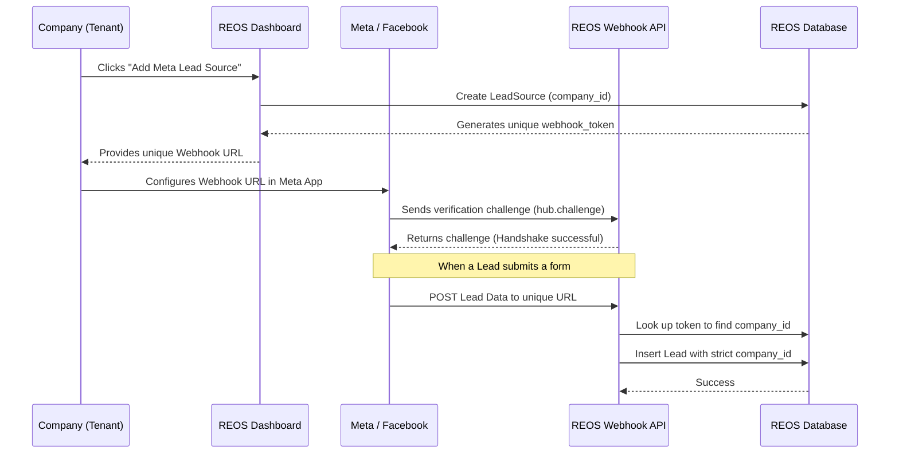

# Meta Lead Ads Integration - Multi-Tenant Architecture Guide

This guide explains how the REOS SaaS application handles Meta (Facebook/Instagram) Lead Ads across multiple companies (tenants) securely and independently.

## Overview
The REOS platform uses a **Unique Webhook-based Multi-Tenant Architecture**. This means that instead of relying on a single, global Facebook App that manages permissions for every client, the system empowers each company to connect their own Meta ad accounts independently using unique webhook URLs. 

This approach ensures maximum data privacy, simplifies tenant onboarding, and reduces the risk of global API rate limits or compliance issues.

---

## How It Works: The Data Flow



---

## Step-by-Step Setup for a New Company

When a new real estate company signs up on REOS and wants to connect their Facebook Ads, they will follow these steps:

### 1. Generate the Webhook URL (Inside REOS)
1. The company logs into their REOS admin dashboard.
2. Navigates to **Settings -> Lead Sources**.
3. Clicks on **Add New Source** and selects **Meta (Facebook & Instagram)**.
4. The system automatically creates a record linked to their specific `company_id` and generates a highly secure, unique webhook URL.
   *Example: `https://your-reos-domain.com/api/webhooks/lead-sources/meta/abc123xyz456securetoken`*

### 2. Configure Meta Developer App (Inside Facebook)
1. The company goes to [Meta for Developers](https://developers.facebook.com/).
2. Creates an App (or uses an existing one) and adds the **Webhooks** and **Lead Ads** products.
3. Under the Webhooks section, they click **Subscribe to this Object** (Page).
4. They paste the **Callback URL** provided by REOS.
5. They enter any random string as the **Verify Token** (our system currently auto-verifies the handshake).
6. Click **Verify and Save**.

### 3. Subscribe to Lead Fields
Once the webhook is verified, the company subscribes to the `leadgen` field for their specific Facebook Pages.

---

## Technical Architecture & Security

### Tenant Isolation (Data Privacy)
The most critical aspect of a SaaS application is ensuring Company A cannot see Company B's data. 
- **The Token:** The unique `{token}` in the URL is the key. 
- **The Lookup:** When a payload hits the controller (`LeadSourceWebhookController.php`), the system queries the `lead_sources` table using *only* that token. 
- **The Injection:** Once the integration record is found, the system extracts the `company_id`. All subsequent operations (creating the lead, assigning projects, routing to managers) are strictly scoped using that `company_id`.

### The Webhook Controller Logic
```php
// 1. Receive Payload at /api/webhooks/lead-sources/meta/{token}
public function handle(Request $request, string $type, string $token) {
    
    // 2. Identify the Tenant
    $source = LeadSource::where('webhook_token', $token)->first();
    
    if (!$source) {
        abort(404, 'Integration not found');
    }

    // 3. Process securely using the source's company_id
    $manager->processIncomingLead($source, $request->all());
}
```

---

## Next Development Phases
To make this integration production-ready for all clients, the following features are next in the pipeline:

> [!IMPORTANT]
> **1. Intelligent Deduplication**
> If a lead submits multiple forms on Facebook, the system should not create duplicate entries. It will search for the existing phone number within that specific `company_id` and log a new activity/interaction instead.

> [!TIP]
> **2. Real Field Mapping**
> Facebook sends lead data in an array format (e.g., `field_data: [{name: "full_name", values: ["John Doe"]}]`). We need to implement a parser in the `MetaLeadAdapter` to correctly map these dynamic fields to our standard `first_name`, `last_name`, `email`, and `phone` columns.

> [!WARNING]
> **3. Enhanced Token Security (X-Hub-Signature)**
> To prevent malicious actors from sending fake leads to a company's webhook URL, we will implement Meta's payload validation using the `X-Hub-Signature-256` header to verify the request authentically originated from Facebook.
